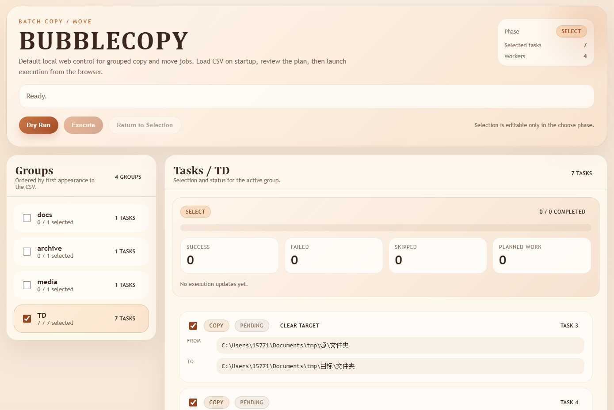

# bubblecopy


[English README](README.md)

用于从 CSV 批量执行分组文件/文件夹复制和移动任务的本地工具。程序现在默认启动浏览器可视化界面，同时保留 Bubble Tea TUI 兼容模式。

## CSV 格式

必填表头：

```csv
source,target,op,clear_target,group
```

规则：
- `op`：`copy` 或 `move`
- `clear_target`：`true` 或 `false`
- `group`：留空时会变成 `ungrouped`
- CSV 编码：推荐使用 `UTF-8`，同时支持 `GB18030/GBK`

## 运行

```bash
go run ./cmd/bubblecopy -config ./tasks.example.csv -workers 4
```

默认会在本机 `127.0.0.1` 上启动一个随机端口的 Web UI，并自动打开默认浏览器。

如果不传 `-config`，程序会自动按顺序查找当前目录和程序所在目录中的 `tasks.csv`、`tasks.example.csv`。
对于打包后的程序，只要把 CSV 放在编译产物同目录，或者从已包含 CSV 的目录启动程序即可。

常用参数：

```bash
# 启动 Web UI，但不自动打开浏览器
go run ./cmd/bubblecopy -config ./tasks.example.csv -no-browser

# 指定本地 Web UI 监听地址
go run ./cmd/bubblecopy -config ./tasks.example.csv -listen 127.0.0.1:8080

# 使用旧版终端 TUI
go run ./cmd/bubblecopy -config ./tasks.example.csv -ui tui
```

## Web 可视化界面

- 默认模式是当前进程内启动的本地单用户 Web UI。
- 浏览器里可以完成任务浏览、分组勾选、dry-run、正式执行、进度查看、最近更新和最终结果统计。
- v1 只负责展示和操作启动时已加载的 CSV，不包含浏览器内上传、编辑、保存 CSV。

## 发布

GitHub Actions 会在你推送版本标签后，自动构建并发布 GitHub Release，产出：
- Windows `amd64` 和 `arm64`
- macOS `amd64` 和 `arm64`
- Linux `amd64` 和 `arm64`

触发方式示例：

```bash
git tag v1.0.0
git push origin v1.0.0
```

每个 Release 资产里都包含编译后的程序、`tasks.example.csv` 以及中英文 README。

## TUI 按键

以下按键仅在显式使用 `-ui tui` 时生效：

- `Left/Right`：在左侧分组面板和右侧任务面板之间切换焦点
- `Up/Down` 或 `j/k`：移动光标
- 在分组上按 `Space`：选中或取消选中该分组下的全部任务
- 在任务上按 `Space`：切换单个任务的选中状态
- 第一次按 `Enter`：执行 dry-run
- 第二次按 `Enter`：正式执行
- `q`：退出

## 动画执行界面

- 界面整体使用偏暖、高饱和度的配色，标题、边框、焦点和状态标签统一采用琥珀、橙色、珊瑚色系。
- 在选择阶段，分组面板和任务面板都会显示焦点动画和 Unicode 图标，让导航更直观。
- 在执行阶段，会显示实时 spinner、暖色渐变进度条、动态运行图标、完成计数（`done/total`）以及滚动更新的成功/失败/跳过统计。
- `Current` 行会实时显示最近一次更新的任务。
- 在结果阶段，动画会停止，并保留最终汇总信息。
